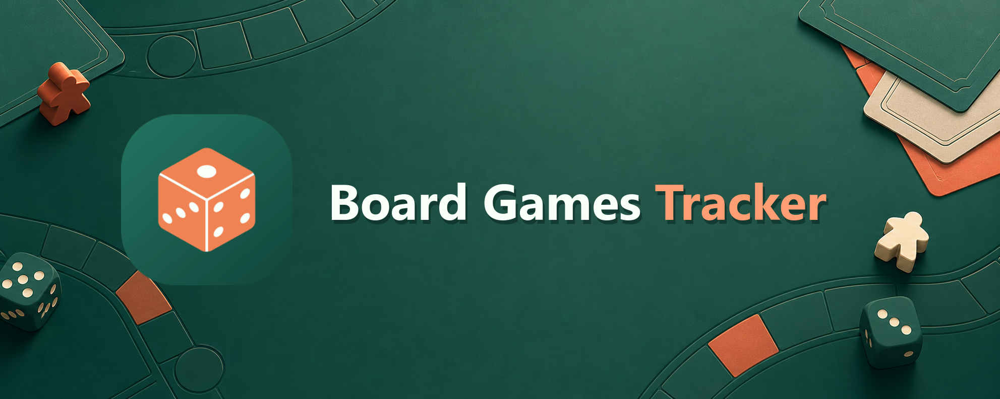
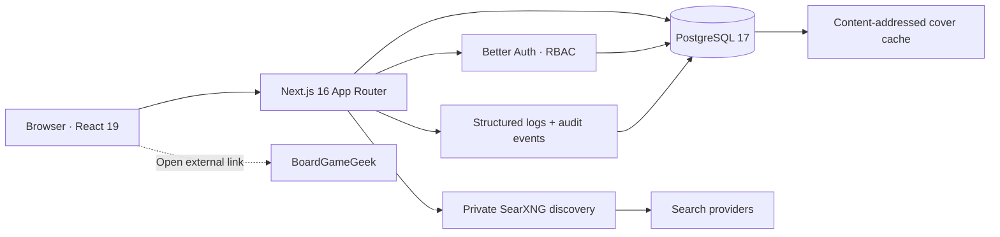

<div align="center">
  <picture>
    
  </picture>

# Board Games Tracker

   

</div>

Board Games Tracker is a secure, self-hosted home for a board-game collection. It presents each user's games in a calm visual shelf, supports multiple local users, and settles game-night indecision with a filterable animated picker.

## Table of contents

- [Features](#features)
- [Architecture](#architecture)
- [Quick start with Docker](#quick-start-with-docker)
- [Local development](#local-development)
- [Environment](#environment)
- [Database workflow](#database-workflow)
- [Quality gates](#quality-gates)
- [Project structure](#project-structure)
- [Security model](#security-model)
- [Backups and upgrades](#backups-and-upgrades)
- [License](#license)

## Features

- Responsive light/dark interface inspired by modern travel and mobility products
- Email/password accounts with secure server-side sessions and administrator roles
- Fuzzy English/Italian collection and discovery search with stop-word removal, typo tolerance, and compact queries such as `7wonders`
- Main-game shelves with expansions grouped beneath the most likely owned base game
- Local add/remove, favorites, gifted-game labels, purchase prices, BGG ratings, player counts, and duration with animated in-app confirmations
- Secure BGG CSV collection import for owned games, ratings, plays, and notes
- Token-free SearXNG discovery, PostgreSQL-cached BGG artwork, enriched publication years, and direct BGG links
- Game-night picker with candidate cover art, separate searchable multi-select mechanic/theme filters, optional expansion exclusion, and a labeled animated wheel
- Collection analytics for spending, price coverage (including gifts), complexity, expansions, favorites, categories, and mechanics
- Administrative console for roles, bans, session revocation, account deletion, health metrics, and paginated audit events
- Typed English and Italian localization with `next-intl`, ICU plurals, locale-aware formatting, and a persisted language preference
- PostgreSQL migrations, Docker deployment, structured redacted logs, strict TypeScript, ESLint, Prettier, Husky, lint-staged, and Vitest

> Board Games Tracker is independent software and is not affiliated with BoardGameGeek. SearXNG discovers indexed BGG links and BGG-hosted artwork; a bounded, best-effort server-side scrape enriches selected games. There is no BGG token, account association, or collection synchronization.

## Architecture



Server Components read data directly from the typed Drizzle data layer. Server Actions and Route Handlers validate all untrusted input, re-check authentication and ownership, and record security-relevant mutations. `src/proxy.ts` adds CSP and modern browser-security headers while protected layouts perform authoritative session and role checks.

## Quick start with Docker

Requirements: Docker Engine with Compose v2 and a public HTTPS URL for production.

1. Create `.env` beside `docker-compose.yml`:

   ```dotenv
   POSTGRES_PASSWORD=replace-with-a-long-random-password
   BETTER_AUTH_SECRET=replace-with-at-least-32-random-characters
   APP_URL=http://localhost:12500
   ADMIN_EMAIL=you@example.com
   ALLOW_SIGN_UP=false
   APP_PORT=12500
   LOG_LEVEL=info
   SEARXNG_SECRET=replace-with-a-different-random-secret
   ```

2. Start the database and application:

   ```bash
   docker compose up --build -d
   ```

3. Open `http://localhost:12500`. When the database has no users, Board Games Tracker automatically presents first-time setup and makes the first account an administrator. Public registration closes as soon as that account exists. Pending SQL migrations run automatically before the server starts.

For production, put the app behind a TLS-terminating reverse proxy, set `APP_URL` to the exact external `https://` origin, restrict database access to the private Docker network, and back up the `board_games_tracker_data` volume.

When upgrading an existing Docker installation, set `POSTGRES_DB`, `POSTGRES_USER`, and `POSTGRES_VOLUME_NAME` to the names already used by that installation before starting the renamed stack. Compose will then reuse the existing database and physical volume instead of initializing new storage.

## Local development

Requirements: Node.js 22 LTS, pnpm 11.8+, and PostgreSQL 17.

```bash
pnpm install --frozen-lockfile
cp .env.example .env.local
pnpm db:migrate
pnpm dev
```

PowerShell equivalent: `Copy-Item .env.example .env.local`.

Generate secrets with a cryptographically secure tool such as `openssl rand -base64 32`. Never reuse the example values.

### Game discovery

Board Games Tracker queries a private SearXNG JSON endpoint for indexed BoardGameGeek game links and BGG-hosted cover images. Missing publication years are enriched from Wikidata's CC0 data by exact BGG ID. Docker Compose includes a SearXNG service that is reachable only from the private application network. For local development outside Compose, run a private SearXNG instance with JSON output enabled and set `SEARXNG_URL` to its origin. Public SearXNG instances commonly disable JSON responses and should not be treated as an application dependency.

Official BGG collection CSV exports can be uploaded from Settings. Imports are restricted to 5 MB and 2,000 rows, validate the expected BGG columns and field bounds, and only add rows explicitly marked as owned. Imported BGG IDs are used to discover and download covers in bounded batches.

Owned games and future purchases are kept in separate Collection and Wishlist views. Moving a wishlist item into the collection records either its purchase price or that it was gifted. Gifted games count toward price coverage while contributing zero to spend, average, and median calculations. The Stats view summarizes spend, price coverage, complexity, expansions, favorites, and the most common categories and mechanics. Play histories are deliberately not collected.

Settings can export the signed-in user's Board Games Tracker profile preferences, collection, wishlist, personal metadata, and shared game metadata as JSON, CSV, XLSX, or SQL. All four formats import through the same bounded, versioned validator and merge by BGG ID. Uploaded SQL is parsed only as Board Games Tracker's escaped data envelope and is never executed. Credentials, sessions, audit logs, and other users' data are excluded.

Search terms are normalized for punctuation, diacritics, adjoining words and numbers, and English/Italian stop words before fuzzy ranking. Search results are filtered to exact HTTPS `boardgamegeek.com/boardgame/{id}` links. The user supplies player counts, duration, complexity, taxonomy, purchase price, and optional artwork before saving. Board Games Tracker stores only explicitly added games. It makes bounded, best-effort server-side reads of the structured data backing each selected or imported game's public BGG credits page to enrich categories, mechanics, and themes; BGG may block automated requests, so all metadata remains manually editable and scraping fails softly.

Selected artwork is downloaded only from the exact HTTPS `cf.geekdo-images.com` host. JPEG, PNG, and WebP signatures are verified, downloads are limited to 5 MB and 12 seconds, and redirects are rejected. Image bytes are deduplicated in PostgreSQL by SHA-256 checksum alongside their MIME type, byte size, and source URL. A same-origin content-addressed route serves them with immutable caching, ETags, and MIME-sniffing protection.

## Environment

| Variable              | Required    | Purpose                                                        |
| --------------------- | ----------- | -------------------------------------------------------------- |
| `DATABASE_URL`        | Yes         | PostgreSQL connection URL                                      |
| `BETTER_AUTH_SECRET`  | Yes         | High-entropy session/encryption secret, at least 32 characters |
| `BETTER_AUTH_URL`     | Yes         | Exact server origin; no trailing path                          |
| `NEXT_PUBLIC_APP_URL` | Yes         | Exact browser-visible origin                                   |
| `ADMIN_EMAIL`         | No          | Registration email promoted to admin; unset after bootstrap    |
| `ALLOW_SIGN_UP`       | No          | Allows accounts after bootstrap; secure default is `false`     |
| `HEALTH_CHECK_TOKEN`  | No          | Bearer token protecting the database-backed health probe       |
| `LOG_LEVEL`           | No          | `debug`, `info`, `warn`, or `error`; defaults to `info`        |
| `SEARXNG_URL`         | Yes         | Private SearXNG origin used for server-side discovery          |
| `SEARXNG_SECRET`      | Docker only | Independent high-entropy secret for the bundled SearXNG        |

`BETTER_AUTH_URL` and `NEXT_PUBLIC_APP_URL` must match the deployed origin. A mismatch is intentionally rejected by trusted-origin and cookie protections.

## Database workflow

```bash
pnpm db:generate   # create a reviewed SQL migration from schema changes
pnpm db:migrate    # apply committed migrations
pnpm db:studio     # inspect a local database
pnpm images:cache  # cache up to 500 existing remote cover references
```

Commit both schema changes and generated files under `drizzle/`. Never use `db:push` against production.

## Quality gates

```bash
pnpm check         # types, lint, formatting, tests, and Knip in parallel
pnpm build         # production compilation
pnpm audit         # dependency advisory check
```

Husky runs lint-staged before each commit. Exported functions and components carry JSDoc summaries; implementation comments are deliberately kept out of expression lines.

## Project structure

```text
BoardGamesTracker/
├── drizzle/                  # Reviewed PostgreSQL migrations and snapshots
├── messages/                 # Typed next-intl UI catalogs by locale
├── scripts/                  # Migration and artwork-cache utilities
├── searxng/                  # Private metasearch configuration
├── src/
│   ├── app/                  # Routing-only Next.js pages, layouts, and handlers
│   ├── components/           # Atomic Design atoms, molecules, organisms, and templates
│   ├── core/                 # Isomorphic domain folders with colocated contracts and types
│   ├── hooks/                # Reusable client hooks
│   ├── i18n/                 # Request config, locale rules, and domain catalogs
│   ├── server/               # Auth, data access, actions, discovery, imports, and security
│   └── utils/                # Client-safe taxonomy, search, picker, currency, and statistics
├── docker-compose.yml        # App, PostgreSQL, and SearXNG production stack
├── drizzle.config.ts         # Typed migration configuration
└── package.json              # Runtime dependencies and quality commands
```

Pages remain server-rendered by default. Interactive behavior is isolated in focused Client Components, while reusable filtering, validation, and formatting live outside route files.

Core domains use `fileName.contract.ts` for Zod boundaries and `fileName.ts` for domain types or behavior. Tests use `fileName.test.ts(x)` beside the implementation they exercise; message-catalog tests live with the catalogs in `messages/`.

## Security model

- Password hashing, session rotation, CSRF/origin validation, secure cookie attributes, login throttling, and banned-user checks are provided by Better Auth.
- Every private page validates the full database-backed session. The proxy cookie check is only an early redirect optimization.
- Collection mutations include the acting user ID in their database predicate. Admin mutations require a live admin session and protect the acting/final admin.
- User-data imports are same-origin, size-limited, schema-validated, and never execute uploaded SQL. Exports are private, uncached, and omit authentication data.
- Expensive discovery and collection-import actions use bounded per-user rate limits. Multi-instance deployments should replace the documented per-instance limiter with a shared store.
- A restrictive CSP, HSTS in production, anti-framing, MIME sniffing protection, referrer controls, and feature restrictions are applied centrally.
- Metasearch responses are treated as untrusted input. Only strict BGG game URLs are accepted, and short-lived signed selection tokens prevent client-side identity tampering.
- Remote artwork is restricted to the BGG image CDN, bounded while streaming, verified by file signature, hashed, and served from PostgreSQL through immutable same-origin URLs.
- Application logs use JSON and drop common credential fields. Durable audit records capture actor, action, target, time, and request IP without passwords or cookies.
- The runtime container is non-root, the database is not published to the host, and the optionally bearer-protected health output contains no internal diagnostics.

See [SECURITY.md](SECURITY.md) for reporting and operating guidance.

## Backups and upgrades

Back up PostgreSQL with `pg_dump` or volume snapshots before upgrades; these backups include cached cover bytes. Test restoration regularly. To upgrade, review release notes, update dependencies, run the full quality gates, build a new immutable image, and let the startup migration complete before serving traffic. Keep at least one previous image and database backup for rollback.

## License

MIT. See [LICENSE](LICENSE).
