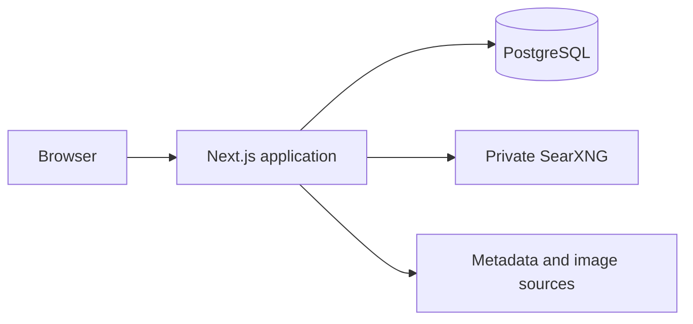

<div align="center">
  <div style="display: flex; padding-block: 40px; margin-bottom: 20px; background-color: #1f1f1f">
    <picture>
      
    </picture>
  </div>
</div>

# Board Games Tracker

A self-hosted board-game collection manager and game-night picker built with
Next.js, TypeScript, and PostgreSQL. Board Games Tracker keeps a household's
collection, wishlist, ratings, notes, prices, and game-night decisions in one
private application you run yourself.

              

There is no hosted service and no account to sign up for. Start with the
[Docker setup](#docker), work on it through [local development](#local-development),
or review the [security model](#security).

## Tech Stack

- **Framework**: Next.js 16 App Router, React 19 Server Components, and server
  actions.
- **Language**: TypeScript 6 in strict mode, with Zod contracts at every trust
  boundary.
- **Styling**: Tailwind CSS 4, Radix UI primitives, `next-themes`, and Recharts
  for statistics.
- **Data**: PostgreSQL 17 with Drizzle ORM and checked-in migrations.
- **Authentication**: Better Auth with server-side sessions and role-based
  administration.
- **Discovery**: A private SearXNG instance for multilingual metadata and
  artwork lookup.
- **Internationalization**: `next-intl` with English and Italian catalogs.
- **Quality**: Vitest, Testing Library, ESLint, Prettier, Knip, and Husky.
- **Hosting**: Docker Compose with PostgreSQL, SearXNG, and health checks.

## What Board Games Tracker includes

### A collection and a wishlist

- Separate collection and wishlist views with ownership, favorites, played
  status, and gifted purchases.
- Personal ratings, notes, tags, player counts, play times, and money spent.
- Search plus filters for player count, duration, complexity, categories,
  mechanics, favorite and played status, and base games versus expansions.
- Sticky library controls, with more games loading as you scroll, so large
  shelves stay quick to browse.
- Expansions grouped under the base game they belong to.
- Moving a wishlist entry into the collection, and clearing either library
  behind a typed confirmation.

### Metadata discovery and imports

- Multilingual search through a private SearXNG instance, proxied by the server
  so the browser never reaches it directly.
- A preview step before a game is added, with manual resolution of incomplete
  metadata.
- BoardGameGeek collection CSV import that keeps only owned rows, restores
  played status from `numplays`, and reports what it skipped.
- Remote artwork fetched, cached, and served from same-origin routes.

> BoardGameGeek is a trademark of BoardGameGeek, LLC. This project is
> independent and is not affiliated with or endorsed by BoardGameGeek.

### A game-night picker and statistics

- A shared candidate pool for the table, constrained by player count and
  duration.
- A picker that makes the final call so the group does not have to.
- Charts for spending, complexity, the lightest and heaviest games, player
  counts, session length, publication decades, and the most-owned categories
  and mechanics, alongside total, average, and median spend.

### Accounts, sharing, and administration

- The first registered account becomes the administrator.
- Administrators control registration and manage users and audit events.
- Optional SMTP delivery supports email verification, password recovery,
  confirmed email changes, and confirmed account deletion.
- Share links expose only the collection data explicitly selected for sharing.
- English and Italian interfaces, light and dark themes, and a responsive
  mobile layout.

## How it works

1. The browser talks only to the Next.js application.
2. Server actions and route handlers authenticate the request, validate input,
   and enforce ownership in the same query as the mutation.
3. PostgreSQL stores accounts, sessions, collection records, cached metadata,
   and audit events.
4. Discovery requests pass through the server to the private SearXNG container.
5. Remote game images are fetched server-side and served through same-origin
   routes.



Neither PostgreSQL nor SearXNG needs to be publicly reachable. In production,
put the application behind a TLS-terminating reverse proxy and expose only the
application port.

## Getting Started

Everything that builds, tests, or runs the application lives in
`board-games-tracker/`. Run the commands below from that folder.

### Docker

Docker Compose runs the complete stack: PostgreSQL, SearXNG, and the
application, with health checks and a persistent database volume.

1. Go to the application folder and copy the environment template:

   ```bash
   cd board-games-tracker
   cp .env.example .env
   ```

2. Set at least these values in `.env`:

   ```dotenv
   POSTGRES_PASSWORD=replace-with-a-strong-password
   BETTER_AUTH_SECRET=replace-with-at-least-32-random-characters
   APP_URL=http://localhost:12500
   SEARXNG_SECRET=replace-with-another-random-secret
   ```

3. Build and start the stack:

   ```bash
   docker compose up --build -d
   ```

4. Open <http://localhost:12500> and create the first account, which is promoted
   to administrator. Keep `ALLOW_SIGN_UP=false` unless public registration is
   intentional.

Everything after the first start, including backups, upgrades, and every
supported setting, is in [DEPLOYMENT.md](./DEPLOYMENT.md).

### Local development

You need [Node.js](https://nodejs.org/) 24.18 or newer,
[pnpm](https://pnpm.io/) 11.21 or newer, a PostgreSQL database, and a reachable
SearXNG instance.

```bash
cd board-games-tracker
pnpm install
cp .env.example .env.local
```

Edit `DATABASE_URL`, `BETTER_AUTH_URL`, `NEXT_PUBLIC_APP_URL`, and
`SEARXNG_URL` to point at your local services, then run:

```bash
pnpm db:migrate
pnpm dev
```

The application and Drizzle commands both read `board-games-tracker/.env.local`.
Application URLs must be HTTP(S) origins without paths, credentials, queries, or
fragments. The development server listens on <http://localhost:12500>.

## Your data stays yours

Accounts, collection records, preferences, and cached game metadata live in
your PostgreSQL database and nowhere else. The application exports user-owned
library data as JSON, CSV, XLSX, or SQL, without credentials, sessions, or
audit records.

Discovery does contact the metadata and image sources configured through
SearXNG, so review those sources and their privacy policies before opening the
instance to a group.

## Development workflow

Run these commands from `board-games-tracker/`.

Generate a migration after a schema change, and apply checked-in migrations
before running the application:

```bash
pnpm db:generate && pnpm db:migrate
```

Run the full quality gate and a production build before opening a pull request:

```bash
pnpm check && pnpm test:coverage && pnpm build && pnpm audit --audit-level=moderate
```

`pnpm check` runs TypeScript, ESLint, Prettier, Vitest, and Knip in parallel.
Prettier also checks the Markdown and GitHub files at the repository root.
`pnpm lint:fix` and `pnpm format` fix the mechanical failures. Dependency
advisories are checked separately with `pnpm audit --audit-level=moderate`.

CI additionally runs `pnpm test:coverage`, which fails below the floor set in
`vitest.config.ts`. That floor covers the modules the suite already reaches, so
adding an untested branch to tested code breaks the build.

Persistence tests apply the checked-in migrations to an isolated PGlite
PostgreSQL runtime. They require no Docker, external database, or credentials.
The test runner uses four workers to bound memory use. These tests cover SQL
and application transactions; they do not simulate independent database servers.

Portable uploads are limited to 10 MiB and 2,000 games. XLSX archives additionally
have a 32 MiB expanded-byte limit and a 256-entry limit, checked with `yauzl`
before ExcelJS builds the workbook. BGG CSV uploads allow 5 MiB, with separate
space for multipart overhead in the Server Action limit. Imports preserve
existing shared catalog metadata; administrators make corrections in the console.

Zod contracts live in `src/core/<domain>/*.contract.ts`, and the bounds several
domains share (BoardGameGeek identifiers, publication years, prices, artwork
URLs) live once in `src/core/shared/shared.contract.ts`. Validate untrusted
forms, HTTP responses, imports, and configuration once at entry, then pass typed
values to domain code. Runtime contracts own their inferred TypeScript types;
validation does not grant permission to modify another account's data.

Git hooks are installed by `pnpm install`. Committing formats and lints the
staged files; pushing runs the whole `pnpm check` gate. CI repeats both and adds
the production build, so a hook is a fast warning, not the real gate.

ESLint enforces the architectural boundaries rather than leaving them to review:
imports go through the `@/` alias, `src/core` cannot import `src/server` or
`src/utils`, and Atomic Design stays one-way, so an atom cannot reach for an
organism.

### Releasing a version

The version in `board-games-tracker/package.json` is included in browser and
server errors sent to Bugsink with a `v` prefix. After the quality gates pass
on `main`, CI creates a GitHub Release with the same version as its tag. The
first release uses the existing package version. Later releases update it
automatically from conventional commits: breaking changes advance major,
`feat` advances minor, and other changes advance patch. No manual version edit
or tag is needed.

## Security

- Credentials and sessions stay server-side, in secure `HttpOnly` cookies.
- Every mutation requires authentication, an ownership check in the query, and
  validated input.
- Administrative operations require an explicit administrator role.
- Server Action posts from another origin, or without an `Origin` header, are
  refused before Next.js reads their body.
- Outbound fetches reject unsafe targets and enforce timeouts, size limits, and
  content-type checks.
- Spreadsheet exports neutralize formula-like cells.
- Audit events record security-relevant actions without storing raw secrets.

[SECURITY.md](./SECURITY.md) has the threat model, the deployment checklist,
supported versions, and how to report a vulnerability.

## Documentation

| Document                                                           | Covers                                                       |
| ------------------------------------------------------------------ | ------------------------------------------------------------ |
| [DEPLOYMENT.md](./DEPLOYMENT.md)                                   | Production checklist, backups, upgrades, and every setting   |
| [SECURITY.md](./SECURITY.md)                                       | Threat model, deployment checklist, and vulnerability report |
| [CONTRIBUTING.md](./CONTRIBUTING.md)                               | Contribution workflow and review expectations                |
| [CODING_GUIDELINES.md](./board-games-tracker/CODING_GUIDELINES.md) | Mandatory code, documentation, test, and architecture rules  |
| [`.env.example`](./board-games-tracker/.env.example)               | Complete application and infrastructure configuration        |

## Project Structure

The repository root holds only repository-level files. The application and
everything it needs live in `board-games-tracker/`.

```text
.
├── .github/                     CI, Dependabot, and Copilot instructions
├── board-games-tracker/         The application
│   ├── drizzle/                 Generated database migrations and snapshots
│   ├── messages/                English and Italian message catalogs
│   ├── public/                  Static assets and application artwork
│   ├── scripts/                 Migration, backup, and maintenance commands
│   ├── searxng/                 Private search configuration
│   ├── src/
│   │   ├── app/                 Routes, layouts, and HTTP handlers
│   │   ├── components/          Atomic Design UI: atoms to templates
│   │   ├── client/              Browser-only authentication and cookie adapters
│   │   ├── core/                Framework-free types and validation contracts
│   │   ├── hooks/               Client-side React hooks
│   │   ├── i18n/                Locale routing and request configuration
│   │   ├── server/              Authentication, persistence, actions, and services
│   │   ├── test/                Shared test infrastructure
│   │   └── utils/               Isomorphic single-responsibility helpers
│   ├── CODING_GUIDELINES.md     Code, documentation, test, and architecture rules
│   ├── docker-compose.yml       Application, PostgreSQL, SearXNG, and backup services
│   ├── Dockerfile               Production container build
│   └── package.json             Scripts and dependencies
├── CONTRIBUTING.md
├── README.md
└── SECURITY.md
```

## License

Board Games Tracker is available under the [MIT License](./LICENSE).
