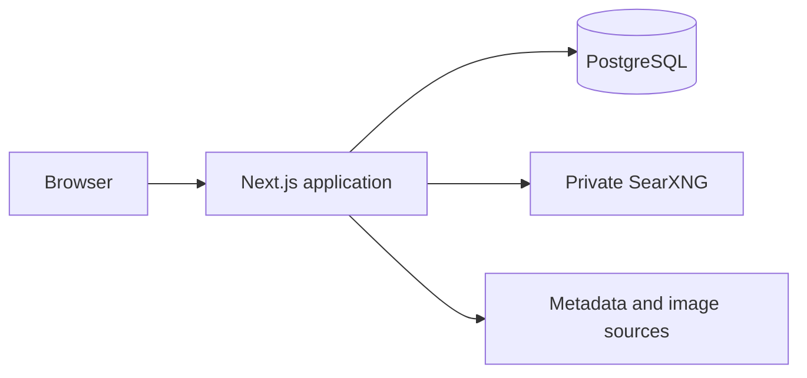

<div align="center">
  <div style="display: flex; padding-block: 40px; margin-bottom: 20px; background-color: #1f1f1f">
    <picture>
      
    </picture>
  </div>
</div>

# Board Games Tracker

A secure, self-hosted board-game collection manager and game-night picker for households, clubs, and private groups.

       

Board Games Tracker keeps your collection, wishlist, ratings, notes, and game-night decisions in one private application. It supports multilingual metadata discovery, BoardGameGeek-compatible imports, portable exports, household sharing, and administrative controls without depending on a hosted collection service.

Start with the [Docker setup](#docker), run it through [local development](#local-development), or review the [security model](#security).

## Tech Stack

- **Framework:** Next.js 16 and React 19
- **Language:** TypeScript 6
- **Styling:** Tailwind CSS 4 and Radix UI primitives
- **Database:** PostgreSQL 17 with Drizzle ORM
- **Authentication:** Better Auth
- **Internationalization:** next-intl
- **Testing:** Vitest and Testing Library
- **Tooling:** pnpm, ESLint, Prettier, Knip, and Husky
- **Deployment:** Docker Compose with a private SearXNG service

## What Board Games Tracker includes

### Collection and wishlist

Maintain separate collection and wishlist views with ownership status, ratings, notes, tags, player counts, play times, and rich game metadata. Search, filtering, sorting, pagination, duplicate handling, batch actions, and bulk deletion are built into the library workflow.

### Discovery and imports

Search multilingual web sources through a private SearXNG instance, inspect a game before adding it, and resolve incomplete metadata without exposing SearXNG directly to the browser. Existing collections can be imported from BoardGameGeek-compatible CSV files, with a preview step for matching and duplicate decisions.

> BoardGameGeek is a trademark of BoardGameGeek, LLC. This project is independent and is not affiliated with or endorsed by BoardGameGeek.

### Game-night picker and statistics

Build a shared candidate pool, apply player-count and duration constraints, and let the picker choose a game for the table. Collection statistics and charts make it easier to understand the library by status, rating, player count, and other stored metadata.

### Accounts, sharing, and administration

The first registered account becomes the administrator. Administrators can control registration and manage users, while share links expose only the collection data explicitly selected for sharing. English, German, Dutch, and Japanese interfaces are included, together with light and dark themes.

## How it works

1. The browser talks only to the Next.js application.
2. Server actions and route handlers validate input, authenticate the request, and enforce ownership.
3. PostgreSQL stores accounts, sessions, collection records, cached metadata, and audit events.
4. Discovery requests pass through the server to the private SearXNG container.
5. Remote game images are fetched and served through same-origin application routes.



Neither PostgreSQL nor SearXNG needs to be publicly reachable. In production, place the application behind a TLS-terminating reverse proxy and expose only the application port.

## Getting Started

### Docker

Docker Compose is the simplest way to run the complete stack. It starts PostgreSQL, SearXNG, and the application with health checks and a persistent database volume.

1. Copy the environment template:

   ```bash
   cp .env.example .env
   ```

   PowerShell:

   ```powershell
   Copy-Item .env.example .env
   ```

2. Set at least these values in `.env`:

   ```dotenv
   POSTGRES_PASSWORD=replace-with-a-strong-password
   BETTER_AUTH_SECRET=replace-with-at-least-32-random-characters
   APP_URL=http://localhost:12500
   SEARXNG_SECRET=replace-with-another-random-secret
   ```

3. Build and start the stack:

   ```bash
   docker compose up --build -d
   ```

4. Open [http://localhost:12500](http://localhost:12500).

The first account created is promoted to administrator. Keep `ALLOW_SIGN_UP=false` unless public registration is intentional.

### Local development

Local development requires Node.js 24.18 or newer, pnpm 11.21 or newer, PostgreSQL, and a reachable SearXNG instance.

```bash
pnpm install
cp .env.example .env.local
pnpm db:migrate
pnpm dev
```

PowerShell:

```powershell
pnpm install
Copy-Item .env.example .env.local
pnpm db:migrate
pnpm dev
```

Update `DATABASE_URL`, `BETTER_AUTH_URL`, `NEXT_PUBLIC_APP_URL`, and `SEARXNG_URL` in `.env.local` for your local services. The development server listens on [http://localhost:12500](http://localhost:12500).

## Deployment

### Production setup

Use Docker Compose as the deployment baseline:

- Put the application behind an HTTPS reverse proxy.
- Set `APP_URL` to the public HTTPS origin.
- Generate unique secrets for PostgreSQL, Better Auth, and SearXNG.
- Keep PostgreSQL and SearXNG on the private Compose network.
- Persist and back up the PostgreSQL volume.
- Configure Sentry-compatible monitoring only when required.

The application container runs database migrations before starting the production server. Review generated migrations before deploying them and take a database backup before every upgrade.

### Upgrades and backups

Back up the named PostgreSQL volume before pulling a new release:

```bash
docker compose exec -T database pg_dump -U board_games_tracker -d board_games_tracker > board-games-tracker.sql
```

Then rebuild and restart:

```bash
docker compose pull
docker compose up --build -d
```

Restore procedures should be tested periodically. A backup is useful only when it can be restored successfully.

## Your data stays yours

Board Games Tracker is designed for self-hosting. Account data, collection records, preferences, and cached game metadata remain in your PostgreSQL database. The application can export user-owned library data as JSON, CSV, XLSX, or SQL without including credentials, sessions, or audit-log records.

Discovery still contacts the metadata and image sources configured through SearXNG, so operators should review those sources and their privacy policies. No hosted Board Games Tracker account or proprietary synchronization service is required.

## Configuration

The checked-in [`.env.example`](./.env.example) documents every supported setting. The most important application variables are:

| Variable                         | Required | Purpose                                                       |
| -------------------------------- | -------- | ------------------------------------------------------------- |
| `DATABASE_URL`                   | Yes      | PostgreSQL connection string                                  |
| `BETTER_AUTH_SECRET`             | Yes      | Authentication signing secret with at least 32 characters     |
| `BETTER_AUTH_URL`                | Yes      | Canonical application origin for local or non-Compose runs    |
| `NEXT_PUBLIC_APP_URL`            | Yes      | Public application origin exposed to the browser              |
| `ADMIN_EMAIL`                    | No       | Additional email address eligible for administrator bootstrap |
| `ALLOW_SIGN_UP`                  | No       | Enables registration when set to `true`                       |
| `HEALTH_CHECK_TOKEN`             | No       | Protects detailed health-check output                         |
| `LOG_LEVEL`                      | No       | Server log verbosity                                          |
| `SEARXNG_URL`                    | Yes      | Server-side SearXNG endpoint                                  |
| `SENTRY_DSN`                     | No       | Server-side Sentry-compatible error reporting                 |
| `NEXT_PUBLIC_SENTRY_DSN`         | No       | Browser-side Sentry-compatible error reporting                |
| `NEXT_PUBLIC_SENTRY_ENVIRONMENT` | No       | Monitoring environment name                                   |
| `NEXT_PUBLIC_SENTRY_RELEASE`     | No       | Monitoring release identifier                                 |
| `SENTRY_AUTH_TOKEN_FILE`         | No       | File containing the source-map upload token                   |

Compose deployments use `APP_URL` for the public origin and derive the internal database and SearXNG addresses automatically. See the template for PostgreSQL, SearXNG, and optional monitoring variables.

## Database and quality workflow

Create migrations after schema changes and apply checked-in migrations before running the application:

```bash
pnpm db:generate
pnpm db:migrate
```

Useful database commands:

```bash
pnpm db:push
pnpm db:studio
```

Before opening a pull request, run the complete quality gate and production build:

```bash
pnpm check
pnpm build
```

`pnpm check` runs TypeScript, ESLint, Prettier, Vitest, and Knip. Dependency audits can be run separately:

```bash
pnpm audit
```

## Security

- Credentials and sessions remain server-side and are stored as secure, `HttpOnly` cookies in production.
- Mutations require authentication, ownership checks, and validated input.
- Administrative operations require an explicit administrator role.
- Remote fetches reject unsafe targets and enforce timeouts, size limits, and content-type checks.
- Spreadsheet exports neutralize formula-like cells to reduce injection risk.
- Audit events record security-relevant actions without storing raw secrets.

Review [SECURITY.md](./SECURITY.md) for the threat model, deployment checklist, vulnerability-reporting process, and supported versions.

## Documentation

| Document                                       | Contents                                                    |
| ---------------------------------------------- | ----------------------------------------------------------- |
| [README.md](./README.md)                       | Features, setup, deployment, and operating guidance         |
| [SECURITY.md](./SECURITY.md)                   | Security model and vulnerability reporting                  |
| [CONTRIBUTING.md](./CONTRIBUTING.md)           | Contribution workflow and review expectations               |
| [CODING_GUIDELINES.md](./CODING_GUIDELINES.md) | Mandatory code, documentation, test, and architecture rules |
| [`.env.example`](./.env.example)               | Complete application and infrastructure configuration       |

## Project Structure

```text
.
├── drizzle/                 Database migrations
├── messages/                Locale message catalogs
├── public/                  Static assets and application artwork
├── scripts/                 Migration, monitoring, and maintenance scripts
├── searxng/                 Private search configuration
├── src/
│   ├── app/                 Routes, layouts, route handlers, and server actions
│   ├── components/          Reusable interface components
│   ├── core/                Shared domain types and contracts
│   ├── hooks/               Client-side React hooks
│   ├── i18n/                Locale routing and request configuration
│   ├── server/              Authentication, persistence, services, and security
│   ├── test/                Shared test infrastructure
│   └── utils/               Focused framework-independent utilities
├── docker-compose.yml       Application, PostgreSQL, and SearXNG services
├── Dockerfile               Production container build
└── package.json             Scripts, dependencies, and package metadata
```

## License

Board Games Tracker is available under the [MIT License](./LICENSE).
