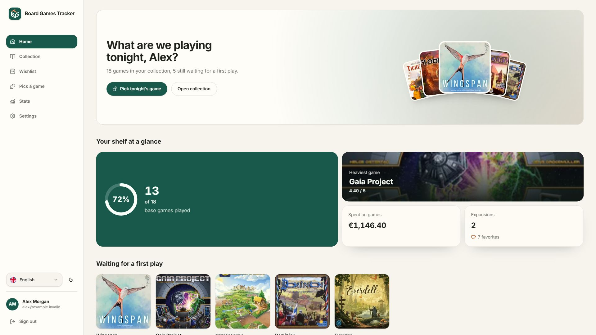
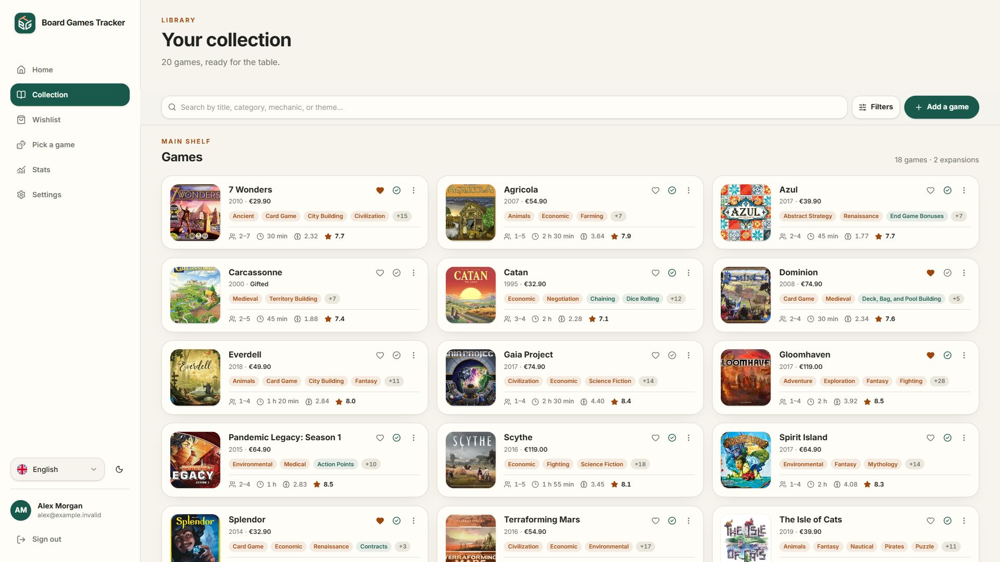
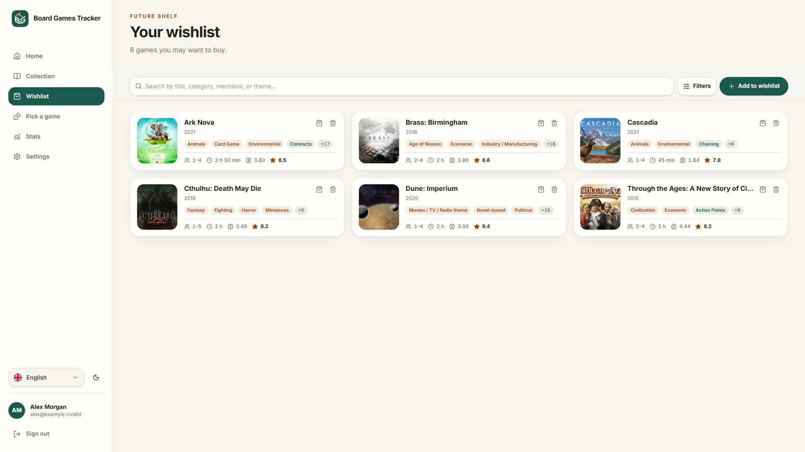
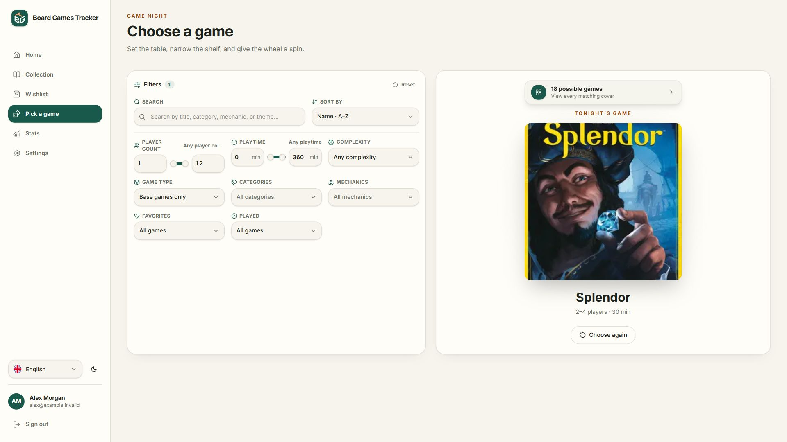
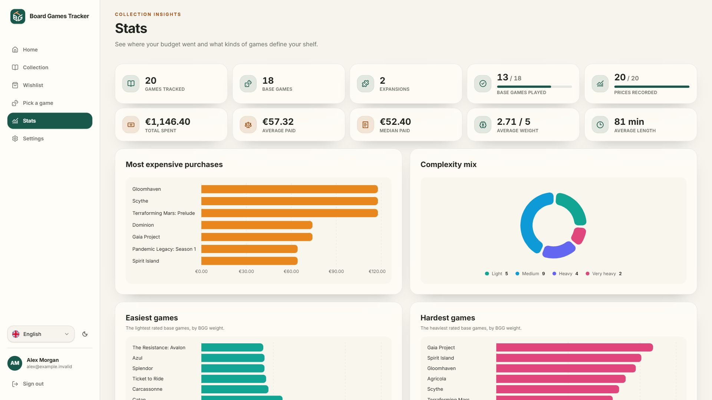
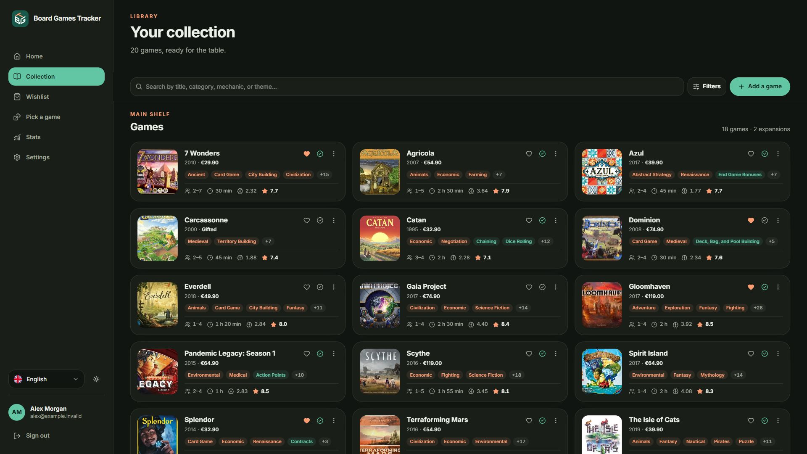
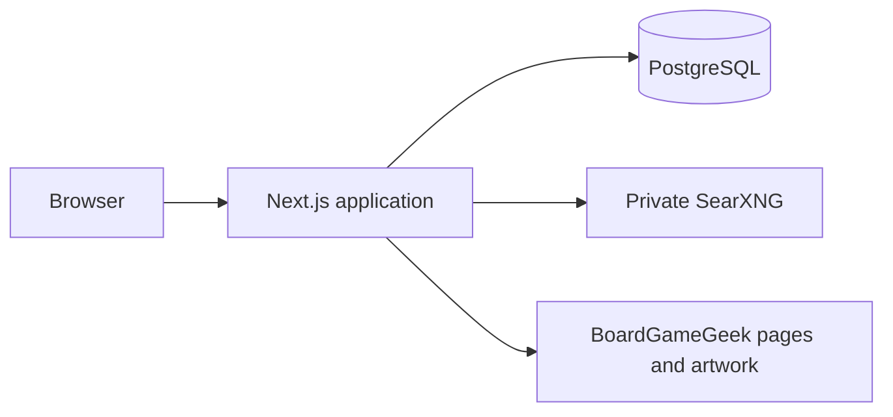

<p align="center">
  
</p>

# Board Games Tracker

A self-hosted app for your board-game shelf: collection, wishlist, prices,
ratings, and a picker for game night. You run it, and your data stays in your
own database.

               

## Explore the app

[Open the live demo](https://demo.boardgames.pivi.dev/) to explore
Alex Morgan's fictional collection, wishlist, game-night picker, and statistics.
No account is needed. The demo is read-only; search, filters, the picker, and
theme controls work in your browser.

These six screenshots show the actual webapp with an example account. Each
image is **1920 × 1080**; click a preview to view it at full size.

| Dashboard                                                                             | Collection                                                                                                    |
| ------------------------------------------------------------------------------------- | ------------------------------------------------------------------------------------------------------------- |
| [](./docs/screenshots/dashboard.jpg)    | [](./docs/screenshots/collection.jpg)                         |
| Wishlist                                                                              | Game night                                                                                                    |
| [](./docs/screenshots/wishlist.jpg)       | [](./docs/screenshots/game-night.jpg)                  |
| Statistics                                                                            | Dark theme                                                                                                    |
| [](./docs/screenshots/statistics.jpg) | [](./docs/screenshots/collection-dark.jpg) |

See [showcase setup](./docs/SHOWCASE.md) for demo deployment and screenshot
reproduction instructions.

## Quick start

You need Docker with Compose.

1. Copy the settings template:

   ```bash
   cd board-games-tracker
   cp .env.example .env
   ```

2. Open `.env` and set these four values:

   ```dotenv
   POSTGRES_PASSWORD=replace-with-a-strong-password
   BETTER_AUTH_SECRET=replace-with-at-least-32-random-characters
   APP_URL=http://localhost:12500
   SEARXNG_SECRET=replace-with-another-random-secret
   ```

3. Start everything:

   ```bash
   docker compose up --build -d
   ```

4. Open <http://localhost:12500> and create an account. The first account
   becomes the administrator.

Registration closes after that first account. Set `ALLOW_SIGN_UP=true` in
`.env` to let other people register.

Backups, upgrades, and every setting are in [DEPLOYMENT.md](./DEPLOYMENT.md).

## Features

**Your library**

- A collection and a wishlist, with favorites, played status, and gifts.
- Your own rating, notes, and price for every game.
- Search and filters for players, duration, complexity, categories, and
  mechanics.
- Expansions grouped under their base game.
- A wishlist game moves into the collection when you buy it.

**Adding games**

- Search by title, or paste a BoardGameGeek link.
- Details and artwork are filled in for you, and you can edit them before
  saving.
- Import the games you own from a BoardGameGeek CSV export.
- Export or restore your library as JSON, CSV, XLSX, or SQL.

**Game night and statistics**

- A picker that chooses a game for your player count and the time you have.
- Charts for spending, complexity, player counts, play time, and publication
  decade.
- Your most-owned categories and mechanics, with total, average, and median
  spend.

**Accounts and sharing**

- An administrator who manages users and reads the audit log.
- A share link for your collection, your wishlist, or both. Prices stay hidden
  unless you choose to show them.
- Optional email for address verification and password recovery.
- English and Italian, light and dark themes, and a layout that works on
  phones.

> BoardGameGeek is a trademark of BoardGameGeek, LLC. This project is
> independent and is not affiliated with or endorsed by BoardGameGeek.

## How it works



- The browser talks only to the application.
- PostgreSQL holds accounts, libraries, cached game details, and the audit log.
- Game search goes through a private SearXNG container. The server downloads
  artwork and serves it itself.

PostgreSQL and SearXNG are never exposed. Your library leaves the server only
through a share link you create or an export you download. Searching for a game
does contact BoardGameGeek and the search engines listed in
`board-games-tracker/searxng/settings.yml`.

## Tech stack

| Area      | Tools                                           |
| --------- | ----------------------------------------------- |
| App       | Next.js 16 (App Router), React 19, TypeScript 6 |
| Interface | Tailwind CSS 4, Radix UI, Recharts, `next-intl` |
| Data      | PostgreSQL 17, Drizzle ORM, Zod                 |
| Accounts  | Better Auth                                     |
| Search    | SearXNG                                         |
| Quality   | Vitest, ESLint, Prettier, Knip, Husky           |

## Development

You need Node.js 24.18 or newer, pnpm 11.21 or newer, a PostgreSQL database,
and a SearXNG instance you can reach.

1. Install and copy the settings template:

   ```bash
   cd board-games-tracker
   pnpm install
   cp .env.example .env.local
   ```

2. In `.env.local`, point `DATABASE_URL`, `BETTER_AUTH_URL`,
   `NEXT_PUBLIC_APP_URL`, and `SEARXNG_URL` at your local services.

3. Create the tables and start the app:

   ```bash
   pnpm db:migrate
   pnpm dev
   ```

The app runs at <http://localhost:12500>.

### Commands

Run them from `board-games-tracker/`.

| Command              | What it does                                    |
| -------------------- | ----------------------------------------------- |
| `pnpm dev`           | Starts the development server                   |
| `pnpm check`         | Types, lint, formatting, tests, and unused code |
| `pnpm test:coverage` | Tests, failing below the coverage floor         |
| `pnpm build`         | Production build                                |
| `pnpm db:generate`   | Writes a migration after you change the schema  |
| `pnpm db:migrate`    | Applies migrations                              |
| `pnpm lint:fix`      | Fixes lint errors                               |
| `pnpm format`        | Fixes formatting                                |

Tests need no database. They run the real migrations against an in-process
PostgreSQL.

### Before a pull request

`pnpm install` sets up Git hooks: a commit formats and lints the staged files,
and a push runs `pnpm check`. The full gate and the rules for a change are in
[CONTRIBUTING.md](./CONTRIBUTING.md).

### Releases

Version bumps go through pull requests, keeping `main` protected. Before a
release, run `npm version minor --no-git-tag-version` from `board-games-tracker/`
(use `patch` for fixes or `major` for breaking changes), and include the
`package.json` change in a PR. CI publishes the tag and GitHub Release after that
versioned commit passes the quality gate on `main`.

Merges without a version bump still deploy the demo. The release job skips
publishing and suggests a bump from the conventional commit messages; it never
pushes a version commit directly to `main`.

### Troubleshooting

**Windows: `ERR_SWC_NATIVE_CACHE` on `pnpm dev` or `pnpm build`.** SWC refuses
its default cache folder when another app has write access to it. Give it a
short folder of your own, then open a new terminal:

```powershell
mkdir "$env:USERPROFILE\.swc-cache"
setx SWC_NATIVE_BINDING_CACHE "$env:USERPROFILE\.swc-cache"
```

Keep the path short. SWC creates long file names inside it, and Windows stops
at 260 characters.

## Security

- Sessions stay on the server, in `HttpOnly` cookies.
- Every change checks the signed-in user and ownership in the same query.
- All input is validated at the boundary with Zod.
- The server fetches only from allowlisted hosts, with timeouts and size
  limits.
- Administrative and privacy changes are written to an audit log.

## Documentation

| Document                                                           | Covers                                  |
| ------------------------------------------------------------------ | --------------------------------------- |
| [DEPLOYMENT.md](./DEPLOYMENT.md)                                   | Going live, backups, upgrades, settings |
| [CONTRIBUTING.md](./CONTRIBUTING.md)                               | How to send a change                    |
| [CODING_GUIDELINES.md](./board-games-tracker/CODING_GUIDELINES.md) | Code, test, and architecture rules      |

## License

[MIT](./LICENSE)
